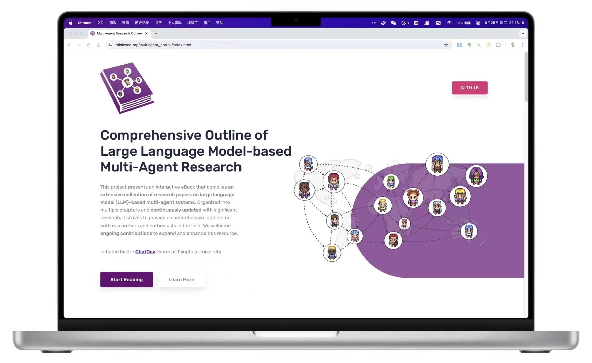
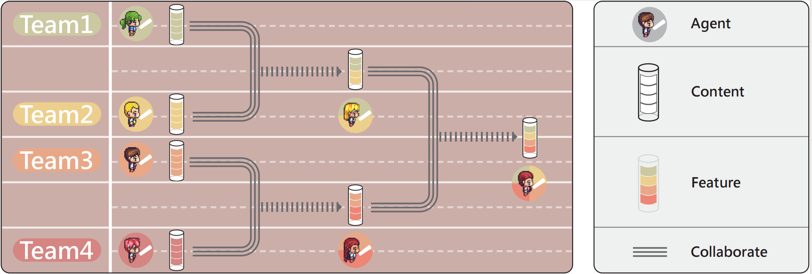

🎉To foster development in LLM-powered multi-agent collaboration🤖🤖 and related fields, our team has curated a collection of seminal papers📄 presented in an interactive e-book📚 format. Explore the latest advancements and download the paper list here: [ebook](https://thinkwee.top/multiagent_ebook)

This project presents an interactive eBook that compiles an extensive collection of research papers on large language model (LLM)-based multi-agent systems. Organized into multiple chapters and continuously updated with significant research, it strives to provide a comprehensive outline for both researchers and enthusiasts in the field. We welcome ongoing contributions to expand and enhance this resource.

---

I am thrilled to showcase my recent work at THUNLP, with heartfelt gratitude to all the mentors and peers who have guided me along the way 😀!

Recently, we have introduced a novel framework for multi-agent team collaboration, known as CTC: Multi-Agent Cross-Team Collaboration. The abstract is illustrated in the figure below.

This framework is adept at efficiently organizing multiple customizable content-generating agent teams. 🚩🚩 While engaging in intra-team linguistic interactions to accomplish task-oriented sub-tasks, it leverages cooperative exchanges at critical phases to obatin external perspectives from different teams, aggregate them into higher-quality, task-oriented content. 🏆 This innovative approach shatters the closed nature of individual agent teams. Furthermore, by incorporating a collaborative group division mechanism, it significantly alleviates the contextual pressure on agents. 🤖

Our research has discovered that as the number of agent teams increases, there is a diminishing return on content quality. By introducing a greedy pruning mechanism, ✂️ we have successfully mitigated this issue, endowing CTC with the capacity and significance to support a large number of agent teams. Additionally, an appropriate level of inter-team diversity allows for the coexistence of innovative and compliant teams within the CTC framework, effectively enhancing the quality of the content generated.

arXiv: [https://arxiv.org/abs/2406.08979](https://arxiv.org/abs/2406.08979).

Repo will merge into [https://github.com/OpenBMB/ChatDev](https://github.com/OpenBMB/ChatDev) .

We warmly welcome your attention and look forward to engaging in enlightening exchanges with esteemed colleagues!

---

 utilize directed acyclic graphs to organize diverse agents for collaborative interactions, with the final solution derived from their dialogues.")

🎉 Our team has recently proposed the Multi-Agent Collaboration Networks (MacNet), as summarized in the figure. Large model agents are deployed on the topology of a directed acyclic graph, and by using topological sorting, the network is "unfolded" into a sequence of interactions for the agents 🤖🤖, driven by language interactions for task-oriented collaboration. Moreover, the network only propagates the solutions after interaction (not the entire conversation), building a scalable memory management mechanism 🧠. 

MacNet supports a variety of heterogeneous topologies and can accommodate thousands of agents working in concert. Additionally, the study found a small-world collaboration phenomenon (topologies that are closer to the properties of small-world networks exhibit superior comprehensive performance). Furthermore, collaborative performance generally follows a Sigmoid trend and is observed "earlier" compared to the neural scaling law.

arXiv paper: [https://arxiv.org/abs/2406.07155](https://arxiv.org/abs/2406.07155)

Repo will merge into [https://github.com/OpenBMB/ChatDev](https://github.com/OpenBMB/ChatDev) .

The research is still in its infancy, and we welcome feedback and corrections from scholars!

Feel free to share this update with your academic network and gather insights from the community. Your openness to feedback indicates a commitment to the iterative improvement of your research, which is highly valued in the academic world.

---
