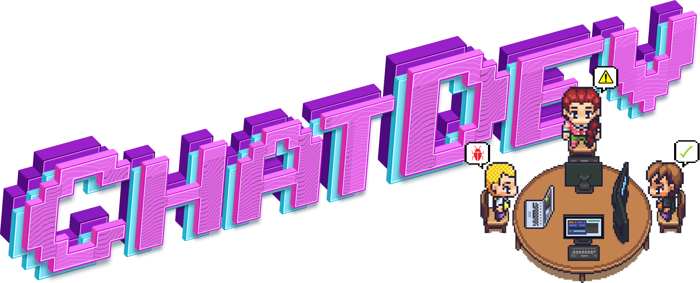
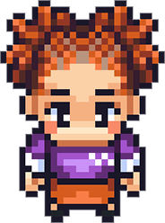
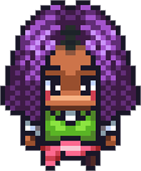
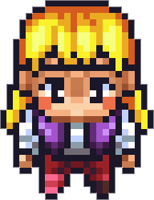
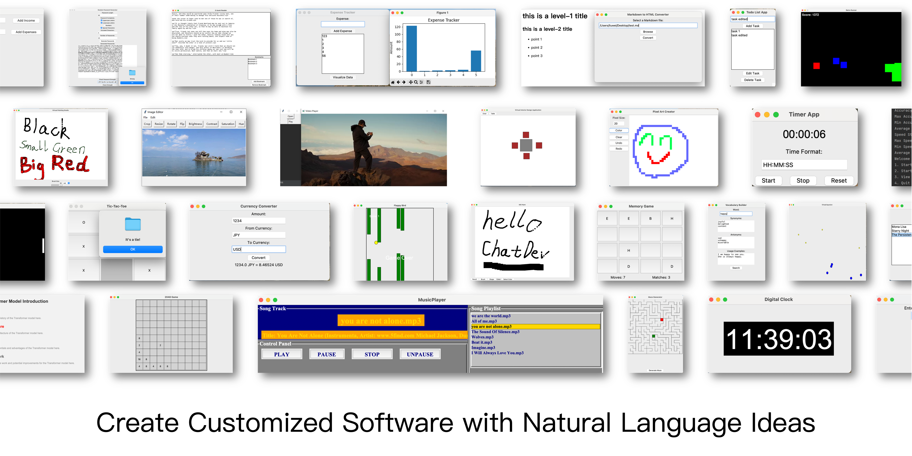

## Comprehensive Outline of Large Language Model-based Multi-Agent Research

🎉To foster development in LLM-powered multi-agent collaboration🤖🤖 and related fields, our team has curated a collection of seminal papers📄 presented in an interactive e-book📚 format. Explore the latest advancements and download the paper list here: [ebook](https://thinkwee.top/multiagent_ebook)

This project presents an interactive eBook that compiles an extensive collection of research papers on large language model (LLM)-based multi-agent systems. Organized into multiple chapters and continuously updated with significant research, it strives to provide a comprehensive outline for both researchers and enthusiasts in the field. We welcome ongoing contributions to expand and enhance this resource.

Multi-agent systems are currently classified into two categories based on whether the agents are designed to achieve specific task goals under external human instructions: task-solving-oriented systems and social-simulation-oriented systems.

- Task solving-oriented multi-agent systems employ autonomous agents working collaboratively to tackle complex problems. Cutting-edge research in this direction revolves around three primary areas: facilitating communication among agents, designing effective organizational structures for interaction, and exploring how agents co-evolve over time.

- Social simulation-oriented multi-agent systems concentrate on modeling and analyzing the social behaviors of agents, offering valuable insights into human dynamics and enhances the ability to analyze or predict social phenomena.

### Frequently Asked Questions

- How is this ebook organized? : This ebook gathers leading research on LLM-powered multi-agent systems since 2023, categorized by key perspectives in the field. As this area rapidly evolves, updates will be ongoing.

- How can I contribute? : We encourage open-source collaboration on this project. You can contribute by submitting a pull request with detailed metadata for notable papers in the [table](https://github.com/OpenBMB/ChatDev/blob/main/MultiAgentEbook/papers.csv).

- How can I download this ebook? : You can download all ebook content in CSV format directly from [here](https://github.com/OpenBMB/ChatDev/blob/main/MultiAgentEbook/papers.csv).

---

## Multi-Agent Cross-Team Collaboration

I am thrilled to showcase my recent work at THUNLP, with heartfelt gratitude to all the mentors and peers who have guided me along the way 😀!

Recently, we have introduced a novel framework for multi-agent team collaboration, known as CTC: Multi-Agent Cross-Team Collaboration. The abstract is illustrated in the figure below.

This framework is adept at efficiently organizing multiple customizable content-generating agent teams. 🚩🚩 While engaging in intra-team linguistic interactions to accomplish task-oriented sub-tasks, it leverages cooperative exchanges at critical phases to obatin external perspectives from different teams, aggregate them into higher-quality, task-oriented content. 🏆 This innovative approach shatters the closed nature of individual agent teams. Furthermore, by incorporating a collaborative group division mechanism, it significantly alleviates the contextual pressure on agents. 🤖

Our research has discovered that as the number of agent teams increases, there is a diminishing return on content quality. By introducing a greedy pruning mechanism, ✂️ we have successfully mitigated this issue, endowing CTC with the capacity and significance to support a large number of agent teams. Additionally, an appropriate level of inter-team diversity allows for the coexistence of innovative and compliant teams within the CTC framework, effectively enhancing the quality of the content generated.

arXiv: [https://arxiv.org/abs/2406.08979](https://arxiv.org/abs/2406.08979).

Repo will merge into [https://github.com/OpenBMB/ChatDev](https://github.com/OpenBMB/ChatDev) .

We warmly welcome your attention and look forward to engaging in enlightening exchanges with esteemed colleagues!

---

## Scaling Large-Language-Model-based Multi-Agent Collaboration

 utilize directed acyclic graphs to organize diverse agents for collaborative interactions, with the final solution derived from their dialogues.")

🎉 Our team has recently proposed the Multi-Agent Collaboration Networks (MacNet), as summarized in the figure. Large model agents are deployed on the topology of a directed acyclic graph, and by using topological sorting, the network is "unfolded" into a sequence of interactions for the agents 🤖🤖, driven by language interactions for task-oriented collaboration. Moreover, the network only propagates the solutions after interaction (not the entire conversation), building a scalable memory management mechanism 🧠. 

MacNet supports a variety of heterogeneous topologies and can accommodate thousands of agents working in concert. Additionally, the study found a small-world collaboration phenomenon (topologies that are closer to the properties of small-world networks exhibit superior comprehensive performance). Furthermore, collaborative performance generally follows a Sigmoid trend and is observed "earlier" compared to the neural scaling law.

arXiv paper: [https://arxiv.org/abs/2406.07155](https://arxiv.org/abs/2406.07155)

Repo will merge into [https://github.com/OpenBMB/ChatDev](https://github.com/OpenBMB/ChatDev) .

The research is still in its infancy, and we welcome feedback and corrections from scholars!

Feel free to share this update with your academic network and gather insights from the community. Your openness to feedback indicates a commitment to the iterative improvement of your research, which is highly valued in the academic world.

---

## ChatDev: Communicative Agents for Software Development

  

### 📖 Overview

- **ChatDev** stands as a **virtual software company** that operates through various **intelligent agents** holding
  different roles, including Chief Executive Officer , Chief Product Officer , Chief Technology Officer , programmer , reviewer , tester , art designer . These
  agents form a multi-agent organizational structure and are united by a mission to "revolutionize the digital world
  through programming." The agents within ChatDev **collaborate** by participating in specialized functional seminars,
  including tasks such as designing, coding, testing, and documenting.
- The primary objective of ChatDev is to offer an **easy-to-use**, **highly customizable** and **extendable** framework,
  which is based on large language models (LLMs) and serves as an ideal scenario for studying collective intelligence.

  

### ❓ What Can ChatDev Do?

<https://github.com/OpenBMB/ChatDev/assets/11889052/80d01d2f-677b-4399-ad8b-f7af9bb62b72>

### 🤗 Share Your Software

**Code**: We are enthusiastic about your interest in participating in our open-source project. If you come across any
problems, don't hesitate to report them. Feel free to create a pull request if you have any inquiries or if you are
prepared to share your work with us! Your contributions are highly valued. Please let me know if there's anything else
you need assistance!

**Company**: Creating your own customized "ChatDev Company" is a breeze. This personalized setup involves three simple
configuration JSON files. Check out the example provided in the ``CompanyConfig/Default`` directory. For detailed
instructions on customization, refer to our [Wiki](../assets/paper/wiki.md).

**Software**: Whenever you develop software using ChatDev, a corresponding folder is generated containing all the
essential information. Sharing your work with us is as simple as making a pull request. Here's an example: execute the
command ``python3 run.py --task "design a 2048 game" --name "2048"  --org "THUNLP" --config "Default"``. This will
create a software package and generate a folder named ``/WareHouse/2048_THUNLP_timestamp``. Inside, you'll find:

- All the files and documents related to the 2048 game software
- Configuration files of the company responsible for this software, including the three JSON config files
  from ``CompanyConfig/Default``
- A comprehensive log detailing the software's building process that can be used to replay (``timestamp.log``)
- The initial prompt used to create this software (``2048.prompt``)
