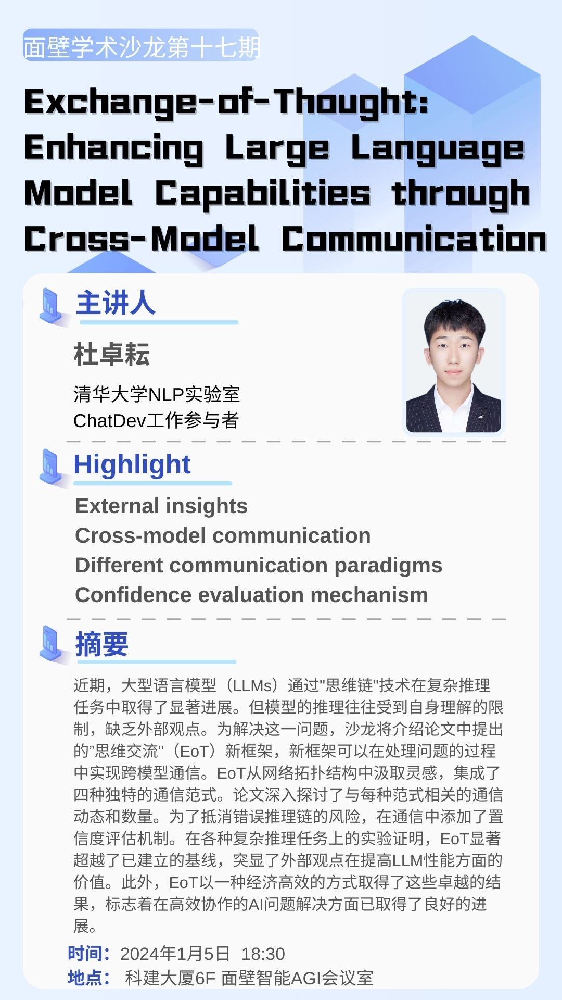

---

## An Academic Salon in [ModelBest](https://modelbest.cn/)

[2024.1.5] Exchange-of-Thought: Enhancing Large Language Model Capabilities
through Cross-Model Communication

Recently, Large Language Models (LLMs) have made significant progress in complex reasoning tasks through "Chain of Thought" technology. However, the models' reasoning is often limited by their own understanding and lack of external perspectives. To address this issue, the salon will introduce the "Exchange of Thoughts" (EoT) framework proposed in the paper, a new framework that enables cross-model communication during problem-solving. Drawing inspiration from network topology, EoT integrates four unique communication paradigms. The paper delves into the communication dynamics and quantities associated with each paradigm. To mitigate the risk of erroneous reasoning chains, a confidence assessment mechanism is added to the communication. Experiments on various complex reasoning tasks have proven that EoT significantly surpasses established baselines, highlighting the value of external perspectives in enhancing the performance of LLMs. Moreover, EoT achieves these outstanding results in a cost-effective manner, indicating that good progress has been made in efficient collaborative AI problem-solving.
  
  

  
Poster

  
  

### [Pdf](../assets/salon_eot.pdf) for this salon.

---

## A Talk in Department of Computer Science and Technology at [Jinan University](http://www.jnu.edu.cn/)

[2023.6.10] How to Plan Your Undergraduate Studies and Life

This talk includes discussions and shares on determining undergraduate effort directions, daily life, scientific research, English learning, and further education planning.

### [Pdf](../assets/talk_exp.pdf) for this talk.

---
